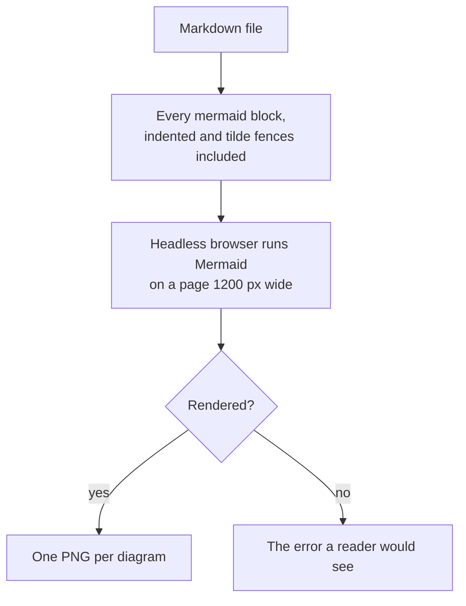

# mermaid

The `mermaid` plugin renders Mermaid diagrams in markdown to images, so each can be looked at before it is done. Its one script is [`render.mjs`](../plugins/mermaid/scripts/render.mjs).

## Rendering

`node plugins/mermaid/scripts/render.mjs <file.md | diagram.mmd> [output-folder]`

- It writes `graph-1.png`, `graph-2.png`, and so on into the output folder when one is given, taken relative to the working directory, and otherwise into a folder of its own under the system's temporary directory, never beside the file.
- It prints each image's path, and says when a diagram shrank to fit the page.
- It exits 0 when every diagram rendered, 1 when one did not or the file holds none, and 2 when it could not render at all.
- It needs a Chromium-based browser, found at its standard location or on `PATH`, or named by `MERMAID_RENDER_BROWSER`. Rendering in a real browser is what lets it draw every diagram type and measure the result as a reader sees it.

## Which Mermaid

A host renders with its own Mermaid release, and releases lay diagrams out differently, so the script renders with a chosen one:

| Release | Why it is here |
| --- | --- |
| 11.17.2, the default | The release GitHub renders, with the classic layout. |
| 12.1.0 | Mermaid 12 lays out flowchart, state, class, ER, and requirement diagrams with ELK by default. |

`MERMAID_RENDER_VERSION` picks one. On first use the script downloads that release's browser bundle from npm through jsDelivr, checks it against the SHA-256 pinned in `render.mjs`, and keeps it in `.mermaid-render` in the home directory, replacing a cached copy that fails the check. The repository carries no copy of Mermaid.

To add a release, add its version and hash to `RELEASES` in `render.mjs`, hashing `dist/mermaid.min.js` from the package npm publishes (`npm pack mermaid@<version>`), not from the CDN.

## Tests

`node tests/mermaid/scripts/run.mjs` from the repository root runs the render script's tests in [`tests/mermaid/scripts/`](../tests/mermaid/scripts/). They render real diagrams, so they need the browser and, on first run, network access.
